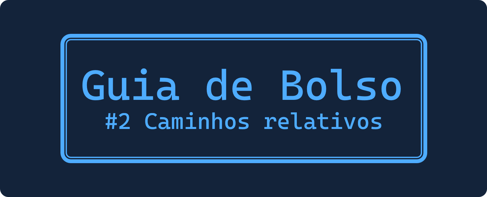

    

 

&nbsp;&nbsp;&nbsp;&nbsp;Vamos entender melhor como funcionam os caminhos relativos com base nos caminhos absolutos.

## Caminhos absolutos
&nbsp;&nbsp;&nbsp;&nbsp;São caminhos onde são definidos o começo, o meio e o fim. Temos como exemplo os caminhos do computador ou mesmo links diretos na internet.

### Caminho do computador
~~~
C:\Users\You\Project\index.html

C: ↴
  Users ↴
       You ↴
          Project ↴
                 index.html
~~~

&nbsp;&nbsp;&nbsp;&nbsp;Uma coisa importante é que caminhos do computador usam ` \ ` que é diferente de quando vamos fazer a mesma referência em algum arquivo, sendo específico para endereçamento dentro da máquina.

&nbsp;&nbsp;&nbsp;&nbsp;Aqui iniciamos nosso caminho em `C:`, ou seja, na unidade de disco principal da máquina. E então continuamos seguindo o fluxo de pastas (diretórios) até chegar ao arquivo alvo, nesse caso o `index.html`.
[//]: # (Josélio de S. C. Júnior - joseliojunior)
&nbsp;&nbsp;&nbsp;&nbsp;Como nosso caminho tem o início, meio e fim definidos, então se trata de um caminho absoluto.

&nbsp;&nbsp;&nbsp;&nbsp;Agora vamos ver um caminho que podemos considerar absoluto para internet.

 

### Caminho da internet
~~~
https://raw.githubusercontent.com/you/project/main/index.html

https:// ↴
        raw.githubusercontent.com ↴
                                 you ↴
                                    project ↴
                                           main ↴
                                               index.html
~~~
&nbsp;&nbsp;&nbsp;&nbsp;Observe que as subpastas (subdiretórios) são separados por ` / ` diferentemente do caminho anterior no computador, sendo este tipo de caminho que trataremos daqui para frente.

&nbsp;&nbsp;&nbsp;&nbsp;Podemos considerar esse caminho absoluto uma vez que inicie com algum padrão `http`, seja ele `http://` ou `https://`, pois significa um começo de link. Logo após segue o corpo do link que finaliza no `index.html`.

&nbsp;&nbsp;&nbsp;&nbsp;É comum utilizarmos caminhos absolutos da internet quando precisamos nos referenciar a arquivos que estão fora do escopo do nosso projeto.

&nbsp;&nbsp;&nbsp;&nbsp;Um exemplo é quando colocamos uma imagem que está em algum outro endereço da internet, daí precisaremos utilizar o caminho absoluto.

### Exemplo em arquivo `.html` de referência a uma imagem
~~~html

~~~

&nbsp;&nbsp;&nbsp;&nbsp;Entretanto, se a imagem ou outro arquivo estiver dentro do escopo do nosso projeto é mais interessante que utilizemos o caminho relativo.

 

## Caminhos relativos
&nbsp;&nbsp;&nbsp;&nbsp;Agora sim chegou a ora de falar deles!!!

&nbsp;&nbsp;&nbsp;&nbsp;Caminhos relativos são dependentes de escopo, ou seja, dependem do contexto de onde são chamados. Desse modo, o mesmo caminho pode se referir a arquivos diferentes dependendo do contexto.

&nbsp;&nbsp;&nbsp;&nbsp;Para exemplificar usarei projetos no repositório do GitHub.

&nbsp;&nbsp;&nbsp;&nbsp;Teremos o projeto `scorpions` e o projeto `pink-floyd`. E em cada um deles vamos fazer uma referência a uma imagem da capa do disco dentro do `index.html`.

### Árvore de pastas de ambos os projetos
~~~
projeto
    ↳ src
        ↳ capa-do-disco.png
    ↳ index.html
~~~
 

### Utilizando caminhos absolutos

scorpions

~~~html

~~~

pink-floyd

~~~html

~~~

&nbsp;&nbsp;&nbsp;&nbsp;Perceba que utilizamos o endereço base `https://raw.githubusercontent.com/`, depois referenciamos ao nosso nome de usuário do GitHub `you`, depois ao nome do projeto, pasta `main` (principal) e por fim a pasta da imagem e a imagem.

&nbsp;&nbsp;&nbsp;&nbsp;Como nossos projetos tem a mesma estrutura, basta mudar o nome do projeto no link para que possamos fazer a referência correta. Apesar disso é mais interessante que utilizemos o caminho relativo nestes casos, vamos ver o porquê.

 

### Utilizando caminhos relativos

scorpions

~~~html

~~~

pink-floyd

~~~html

~~~

&nbsp;&nbsp;&nbsp;&nbsp;O que acontece aqui é que o caminho relativo abstrai toda a base do endereço e considera que você esteja fazendo a referência a partir do seu próprio projeto, ou seja, a pasta (repositório) do projeto é considerada como a base do link automaticamente.

### Exemplo
~~~
https://raw.githubusercontent.com/you/pink-floyd/main/src/capa-do-disco.png
~~~

&nbsp;&nbsp;&nbsp;&nbsp;É o mesmo que o endereço abaixo no contexto do projeto `pink-floyd`.

~~~
./src/capa-do-disco.png
~~~

&nbsp;&nbsp;&nbsp;&nbsp;Porém passa a ser diferente no contexto do projeto `scorpions`, apesar da escrita ser a mesma.
[//]: # (Josélio de S. C. Júnior - joseliojunior)
&nbsp;&nbsp;&nbsp;&nbsp;Para reforçar, imagine que o `./` sintetizasse a ideia que: 

### *"A partir deste repositório que estou, aponte para este caminho a seguir."*

 

    
Feito com ❤️ por mim.

**Josélio de S. C. Júnior - 2021**

